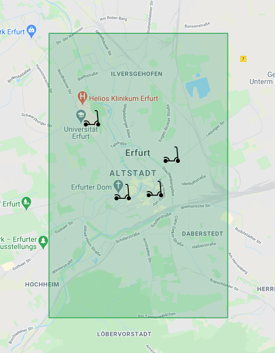

# Scooter-MS

## Scooter Management System

### Used Software and Tools in this project
IntelliJ IDE for development 
[Scribblemaps for the embedded Area Image](https://www.scribblemaps.com/) 
PlantUML integration for IntelliJ

### UML

### Scooter-Map
<!---

-->

