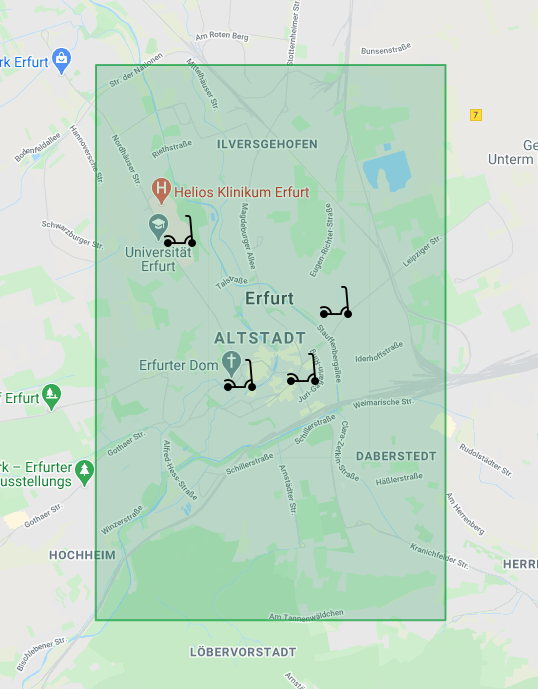
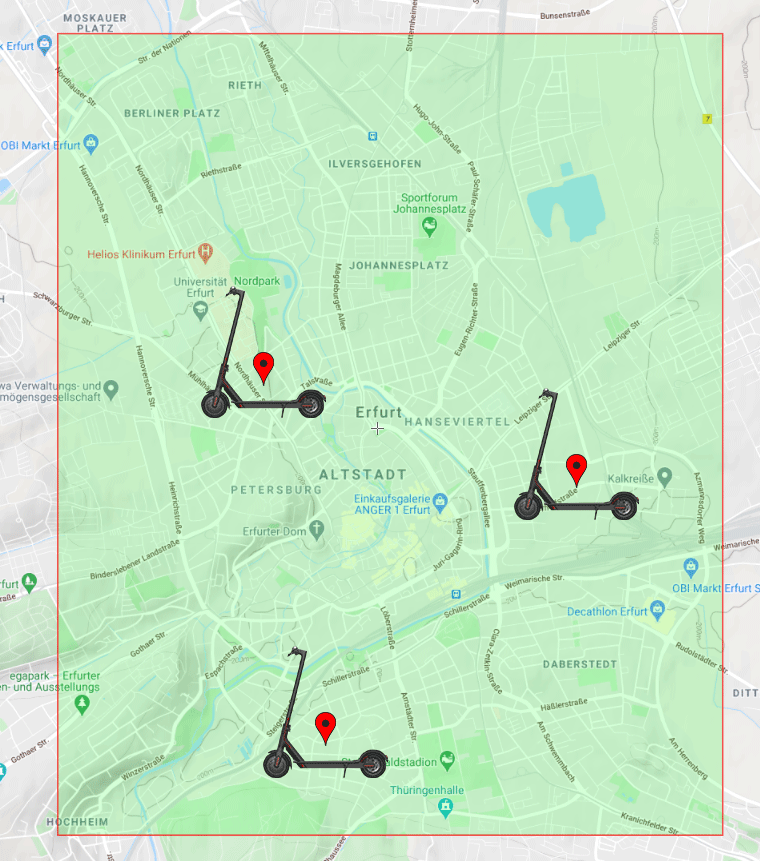

# Scooter-MS

## Scooter Management System

 

 

### Used Software and Tools in this projectapachemaven

- 
  IntelliJ Idea for Development
   
- 
  Scribblemaps.com for the embedded Area Image
   
- 📊 PlantUML IntelliJ integration
   
   

### UML
<!--  -->

 
 

### Scooter-Map
<!---  -->
<!--  -->
<!--  -->

